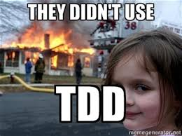

# Test Driven Development Sample



## Unit Tests

* Separate (non production) program/code to test your code
* Test your code on the lowest (unit) layer
* General 3 step structure of a unit test
  * **Given**: Setup unit and environment
  * **When**: Execute unit to test
  * **Then**: Test for expected result

### Why Tests

Michael Feathers, Working Effectively with Legacy Code

> “To me, legacy code is simply code without tests.”

## TDD


* Write your test before your production code
* 3 Phases
  * **Red Phase**: Define a failing test
  * **Green Phase**: Fix that test (Solve Simple)
  * **Refactoring**: Clean up your code

## Sample FizzBuzz

Write a function that returns the number it was given or *Fizz* if it is multiple of 3, *Buzz* if it is multiple of 5 or *FizzBuzz* if it is multiple of both.

### Task

* Can call function `fizzBuzz`
* Return 1 for 1
* Return 2 for 2
* Return Fizz for 3
* Return Buzz for 5
* Return Fizz for 6
* Return Buzz for 10
* Return FizzBuzz for 15

## Build and Run

### CPP

```shell
mkdir -p build
cd build
cmake ..
make
make test
```

### Python

```shell
python3 fizzbuzz.py
```
